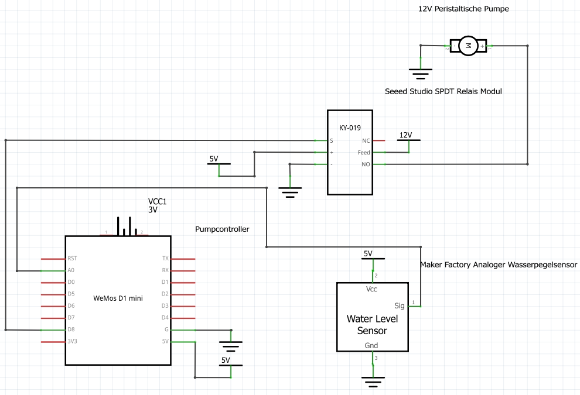
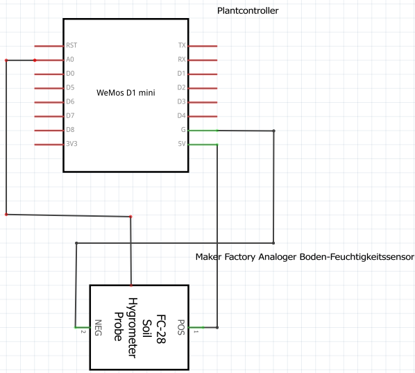
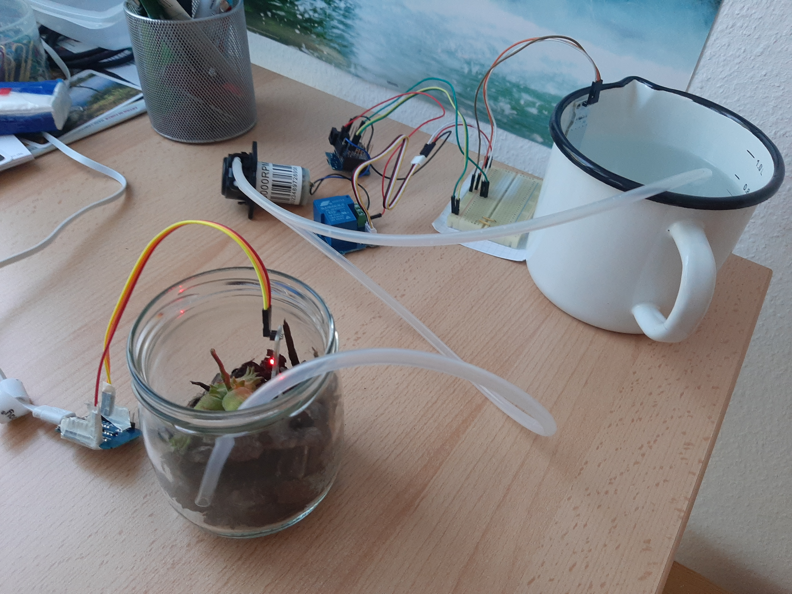
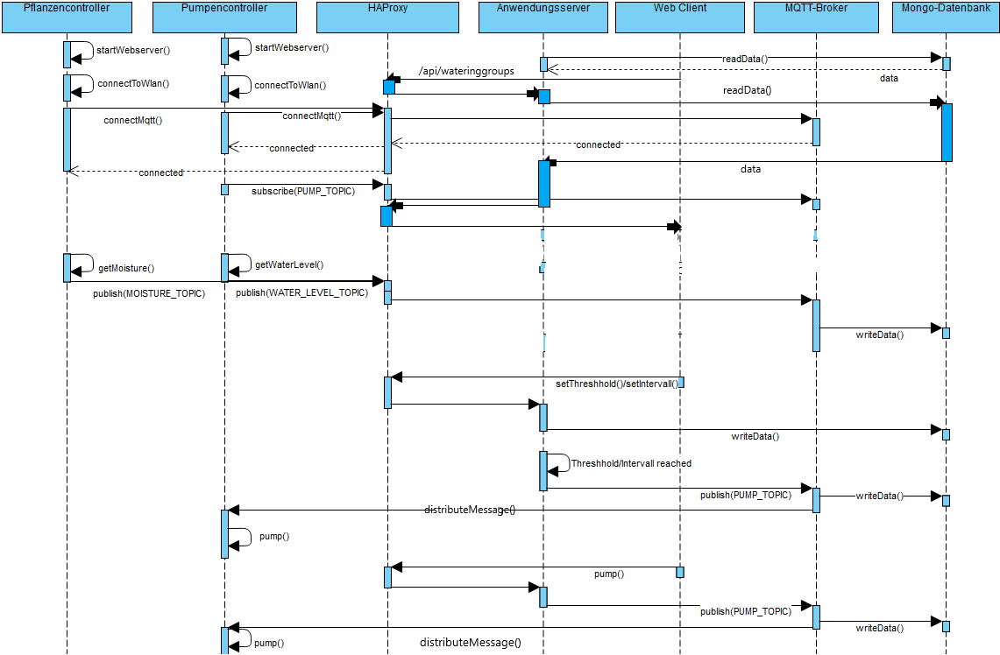

# Smart Garden

> Ein Projekt von Tim Weise und Hendrik Höing im Fach Technische Internetbasierte Systeme im Sommersemester 2020

## Zielsetzung

Ziel des Projekts ist die Umsetzung eines autonomen Bewässerungssystems.
Dieses soll durch eine Überwachung des Feuchtigkeitsgehalts der Pflanzenerde mithilfe von Feuchtigkeitssensoren und einer peristaltischen Pumpe, welche über Schläuche Wasser von einem Tank in die Pflanzenerde befördert, realisiert werden.

Zusätzlich soll der Wasserstand im Tank über einen Wasserstandsensor gemessen werden und übliche Parameter und Metriken über eine mobile Webanwendung einsehbar und steuerbar sein.

## Hardware

### Bauteile
* WeMOS D1 Mini (2x)
* WeMOS DC Power Shield
* 12V DC Power Supply
* Maker Factory  Analoger Wasserpegelsensor
* Maker Factory Analoger Boden-Feuchtigkeitssensor
* 12V Peristaltische Pumpe
* Seeed Studio SPDT Relais Modul
* DC Hohlstecker
* Kaltgerätestecker
* Kabel (für AC und für DC)
* Bread Board
* Jumper Kabel

### Schaltplan 
#### Pumpencontroller

Der folgende Schaltplan beschreibt die technische Verknüpfung der Bauteile für die Kontrollstation mit peristaltischer Pumpe und Wasserstandssensor.
230V aus der Steckdose werden von einem `12V DC Power Supply` runterreguliert und an die `12V Peristaltische Pumpe`, an den `COM`-Ausgang eines `Seeed Studio SPDT Relais Modul` und an einen `WeMOS DC Power Shield` weitergeleitet, welcher die 12V für den `WeMOS D1 Mini` auf 5V wandelt.
 Vom Wemos wird der Strom für den `Maker Factory  Analoger Wasserpegelsensor` bereitgestellt. Über den Pin `A0` kann der Wert ausgelesen werden. 

 Am `Seeed Studio SPDT Relais Modul` wird wieder vom Wemos Strom angelegt. 
  Der Ausgang `N0` wird mit dem Pluspol der Pumpe verbunden. Durch den Pin `D8` vom Wemos kann das Relais geschaltet und somit die Pumpe angesteuert werden.


#### Planzencontroller
Der Pflanzencontroller wird mit 5V Spannung per USB versorgt.
Es wird ein `Maker Factory Analoger Boden-Feuchtigkeitssensor` benutzt, dessen Strom von einem weiteren `WeMOS D1 Mini` bereitgestellt wird.
Über den Pin `A0` kann der Sensor ausgelesen werden.



### Aufbau

In den unteren Abbildung ist der Aufbau der Hardware abgebildet. Die Stromversorgung des Pflanzencontrollers ist wie beschrieben per USB sichergestellt und dessen Feuchtigkeitssensor steckt in der Pflanzenerde.



Zusätzlich mündet ein Wasserschlauch in der Pflanze, welcher am anderen Ende zur peristaltischen Pumpe führt. Ein zweiter, ansaugender Schlauch führt von der Pumpe in einen Wasserbehälter, aus welchem später beim Pumpen das Wasser kommt.

Außerdem befindet sich der Wasserstandssensor in dem Wasserbehälter, dessen Analogausgang mit dem Pumpencontroller verbunden ist. Die Pumpe wird bei geschlossenem Relaiskontakt mit 12V Gleichspannung versorgt, das Relais wird über einen Digitalausgang des WeMOS D1 mini angesteuert. 

Zum Herstellen der Verbindungen, i.B. der beiden Spannungspegel 12V für die Pumpe und 3.3V für die Betriebsspannung des WeMOS wird ein Steckbrett benutzt (siehe Abbildung unten).


## Systemarchitektur

Auf der Hardwareseite besteht das System aus Pumpencontrollern mit jeweils einer Pumpe und einem Wasserstandsensor und aus Pflanzencontrollern mit jeweils einem Feuchtigkeitssensor.

Diese kommunizieren mittels MQTT über TLS verschlüsselt mit einem Broker, welcher Regeln für das Auslösen weiterer Aktionen implementiert.

Darüber hinaus lassen sich Systemkonfigurationen über eine mobile Webanwendung vornehmen, über welche auch Echtzeitwerte des Systems einsehbar sind.

Konkret sind die über die Webanwendung konfigurierbaren Parameter die Feuchtigkeitsschwelle, ab der spätestens bewässert wird und das minimale Pumpintervall, d.h. wann spätestens nach einer Bewässerung erneut bewässert wird, auch wenn die Feuchtigkeitssensoren keine Messwerte unter der konfigurierten Schwelle melden.

Die Autorisierung erfolgt durch das Matching mit einem definierten Topicformat, welches die Form `<userId>/<groupId>/<deviceId>/<actionType/telemetryType>` hat.
Die über `groupId` identifizierten Gruppen sind dabei Zusammenstellungen mehrerer Controller, welche ein separates Bewässerungssystem bilden (ein Bewässerungssystem kann aus mehreren Pflanzen- und Pumpencontrollern bestehen).
Der implementierte `actionType` ist `pump` (Pumpe aktivieren) und die implementierten `telemetryTypes` sind `moisture` (neuer Feuchtigkeitsmesswert) und `waterLevel` (neuer Wasserstands-Messwert).

Sowohl die Messdaten, als auch die Konfigurationen der Systemnutzer und deren Bewässerungsgruppen und Geräte (Pflanzencontroller, Pumpencontroller und Wasserstandssensor werden als Einzelgeräte konfiguriert) werden in einer zentralen Datenbank erfasst.
Es handelt sich dabei um eine extern gehostete MongoDB-Instanz, die nach dem Prinzip _Database as a Service_ bereitgestellt und genutzt wird.

Für die Konfiguration und den Abruf aller Nutzer- und Gerätedaten steht des Weiteren ein Anwendungsserver mit REST-API zur Verfügung, welcher darüber hinaus jedoch auch als Webserver für die mobile Webanwendung fungiert. Wie auch der Broker befindet sich dieser Server hinter einem Reverse-Proxy/ Application Gateway, welcher Verbindungen nur verschlüsselt über HTTPS akzeptiert.

Dieses System aus MQTT-Broker, Anwendungsserver und Reverse-Proxy ist mithilfe von Containern realisiert, die über Docker Compose als Microservices miteinander kommunizieren.

Das System ist auf einem Digital Ocean Droplet (einem sog. _Virtual Private Server_) öffentlich deployt und unter `smartgarden.timweise.com` erreichbar. Es lässt sich aber auch über die Kubernetes Konfigurationen in einem Kubernetes Cluster deployen, um Hochverfügbarkeit zu garantieren.

Eine Übersicht über die Systemarchitektur bietet folgendes Komponentendiagramm:


## Pump-/Pflanzencontroller

### Initialisierung

Zur Einrichtung der Controller ist ein lokaler Webserver mit DNS implementiert. Die Controller laufen im `Access-Point` und `Station Modus`, wodurch der ESP in der Lage ist, einen Access-Point anzubieten und gleichzeitig Daten über WLAN an den Server zu senden.


Über die Internetadresse `esp8266.local/init` kann der Kunde nach dem Einwählen in das ESP-WiFi die Initialisierungsroutine starten.

Die relevanten Webseiten werden mit dem SPIFFS-Speicher ausgeliefert, einem internen Speicher auf dem Microcontroller.

Im ersten Schritt wird das Passwort des Access-Points verändert, da dieses bei der Erstauslieferung immer gleich ist und somit Sicherheitsrisiken aufwirft.
Zusätzlich werden die WLAN-Verbindungsdaten eingetragen, sodass der ESP in der Lage ist, relevante Daten (bspw. Nutzerdaten) an den Server zu senden.
Die entsprechenden Daten werden intern auf dem EEPROM-Speicher des ESP gespeichert, sodass bei einem Neustart des Geräts alle relevanten Daten zur Verfügung stehen.

Bei erfolgreichem Verbinden mit dem WLAN wird der Nutzer auf eine Seite weitergeleitet, in der er sich einloggen soll. Die Nutzerdaten werden an den Server mit einem HTTPS-POST Request gesendet und die erhaltene Nutzer ID, sowie ein Zugriffstoken vom Server intern gespeichert.

Im nächsten Schritt kann der Nutzer eine Pflanzengruppe anlegen. Um das System skalierbar zu halten, wird diese Möglichkeit geboten, damit der Nutzer verschiedene Pflanzengruppen unabhängig voneinander nutzen kann. Dies kann beispielsweise für verschiedene Pflanzen oder verschiedene Gärten genutzt werden.

Wieder wird ein HTTPS-POST Request an den Server gesendet. Dieser beinhaltet das Token zur Authentifizierung des Nutzers, sowie die eindeutige Geräte-ID (`ESP Chip ID`) und den Name der Gruppe. Durch die Nutzer ID, die generierte ID für die Pflanzengruppe und die Geräte-ID wird das MQTT-Topic konstruiert. Der Server speichert dieses Topic in der Datenbank und schickt als Antwort die Gruppen ID an den Controller, der dort auch das Topic konstruiert und im EEPROM speichert.

Die Initialisierung ist im unteren Video abgebildet.


### Funktionsweise

Im folgenden Abschnitt wird die Funktionsweise des Systems und die Kommunikation der Komponenten beschrieben.

Zuerst wird beiden Controllern ein Zertifikat für die Autorisierung für MQTT und HTTPS beim Server aus dem SPIFFS-Speicher ausgelesen, womit ein `WifiClientSecure` konfiguriert wird. 
Als nächstes wird jeweils ein Webserver gestartet, um Konfigurationen vom Nutzer zu erlauben. Danach verbindet sich der Controller mit dem WLAN.
Nach diesen Schritten versuchen die Controller sich als MQTT Client bei dem `MQTT-Broker` anzumelden. Jede Kommunikation an die API durchläuft einen `HAProxy`.
Dieser dient dazu eine verschlüsselte Kommunikation sicherzustellen und je nach Port (Port 8883 für MQTT und Port 443 für HTTPS) den entsprechenden Request weiterzuleiten.



Nach dem erfolgreichen Verbinden mit dem MQTT-Broker subscribed der Pumpencontroller auf das `PUMP_TOPIC`, welches genutzt wird um die peristaltische Pumpe anzusteuern.

Nun wird die `Ticker-Libary` von beiden Controllern benutzt, um in einem gewissen Zeit Intervall jeweils den Feuchtigkeitswert der Pflanze und den Wasserstand des Wasserbehälters zu publishen.

Die Daten der Sensoren kann der Anwendungsserver aus der `Mongo-Datenbank` lesen. Falls ein `Web-Client` diese Daten einsehen will, kann dieser nach dem Einloggen die Web-Applikation nutzen und per API-Request `/api/wateringgroups` über den Proxy die Daten abfragen. Zusätzlich können in der Web-Applikation folgende Werte festlegt werden: einen Schwellwert, ab welcher Feuchtigkeit die Pumpe die Pflanze bewässern soll und ein Intervall, in dem bewässert wird, sollte dies in diesem Zeitraum nicht erfolgt sein. Diese Werte werden pro Benutzer in der Datenbank abgespeichert.

Wie im unteren Video zu sehen, besteht die Möglichkeit die Pumpe direkt anzusteuern. Jeder Pump-Befehl ist eine Nachricht an den MQTT-Broker auf dem `PUMP_TOPIC`.


### WiFi Management

Zur Kapselung und Verbesserung der Code Qualität ist eine Headerdatei implementiert, die das komplette WiFi Management übernimmt.
Diese beinhaltet den Webserver, DNS, Verbindungsmanagement mit dem WLAN und das Senden von Daten per HTTPS Client an den Server.
Über den Webserver kann die Initialisierung erfolgen. Zusätzlich ist dieser dauerhaft erreichbar, um Änderungen am WLAN oder an den MQTT-Topics und das Firmware-Update zu erlauben.

### MQTT Management

Zur Verbindung und Kommunikation über MQTT wird der MQTT-Client `PubSubClient` verwendet. Um eine sichere Verbindung zu gewährleisten wird wieder `WifiClientSecure` benutzt. Zur Autorisierung wird ein Zertifikat, welches im SPIFFS-Speicher hinterlegt ist und ein zugehöriger Fingerprint genutzt. Nach erfolgreicher Autorisierung und Verbindung mit dem Server, wird eine Nutzer ID für den PubSubClient generiert. Hierfür wird die `ESP Chip ID` genutzt. Mit der Nutzer ID wird eine Verbindung zum MQTT-Broker aufgebaut und die entsprechenden MQTT-Topics abonniert.

### Firmware-Update "Over the Air"

Um den Kunden neue Versionen ausliefern zu können, läuft ein Update-Server auf den Controllern. Nach Downloaden der Binärdatei kann diese über `esp8266.local/update` hochgeladen und die neue Version aufgespielt werden.


## Komponenten

### MQTT-Broker

Der MQTT-Broker ist mit Node.js implementiert und baut auf der Aedes-Bibliothek auf.
Aedes ist der Nachfolger von Mosca, einer sehr beliebten Open Source MQTT-Broker-Implementierung in Node.js.

Ein Vorteil von Aedes ist, dass man mithilfe einer Plugin-Bibliothek eine Persistenzschicht für die Message Queue übergeben kann.
In unserem Fall haben wir hierfür dieselbe Mongo-Datenbank, welche auch für die Nutzer- und Gerätedaten verwendet wird, eingebunden. Dies würde nach dem Microservice-Pattern in einer späteren Produktiteration jedoch durch eine dedizierte, weitere Datenbank nur für die Message Queue ersetzt werden.

Über die Handler der Message Queue sind die Regeln implementiert, wann auf `<userid>/<groupid>/<deviceid>/pump` gepublisht wird und wie die Logs in die MongoDB geschrieben werden.

Für die Datenbankinteraktion kommt der Object Document Mapper (ODM) Mongoose zum Einsatz.

```js
/* 
Für alle Nachrichten auf den Topics +/+/+/pump (die + stehen für Wildcards 
("Alle-Platzhalter") auf der jew. Ebene) wird der Callback ausgeführt.
Die Logs werden nach dem vom ODM vorgegebenen Schema 
*/
aedes.mq.on("+/+/+/pump", async (pkg, cb) => {
  const { deviceId, groupId } = parseTopic(pkg.topic);
  writeLogToDb(deviceId, pkg);
  updateLastPumped(groupId);
  cb();
});
```

### Web-Anwendung

Das Webfrontend wurde mit den Frameworks React.js und Ionic realisiert.
Wie auch der Anwendungsserver ist das Frontend in Typescript realisiert, um über statische Typisierung möglichst viele potentielle Fehler zur Compilezeit abzufangen.
Als Single Page Webanwendung lässt sich das kompilierte App-Bundle in ein Verzeichnis des Webservers kopieren und über einen Handler für statische Dateien ausliefern.

```ts
/* 
Für alle Routen, die nicht mit /api beginnen liefert der 
Anwendungsserver die index.html aus, welche den Einstiegspunkt in die Webanwendung darstellt.
*/
app.use(express.static(path.join(__dirname, "..", "public")));
app.get("*", (req, res) => {
  res.sendFile(path.join(__dirname, "..", "public", "index.html"));
});
```

Über ein Formular in der Webanwendung authentifiziert sich der Nutzer außerdem über eine Login-Route gegenüber dem Server, der im Falle korrekt übermittelter Nutzer-Credentials einen JSON-Webtoken ausstellt.

Die clientseitigen Routen sind geschützt und können nur aufgerufen werden, falls ein valides Token im Browserspeicher (localStorage) zur Verfügung steht, die API-Routen sind darüber hinaus durch die Passport-Middleware geschützt, welche das Token auf Validität überprüft.

Für das Auslösen einer Bewässerung wird im Anwendungsserver ein Endpunkt unter `/api/action/pump` bereitgestellt.
Bei eingehenden, authentifizierten Anfragen löst der Callback ein MQTT-Publish auf dem Topic aller der Gruppe zugeordneten Pumpen aus.

Außerdem sind Ansichten zur Anzeige des aktuellen Wasser- und Feuchtigkeitsstands und zur Konfiguration der Bewässerungsgruppen, sowie für den Logot verfügbar.


